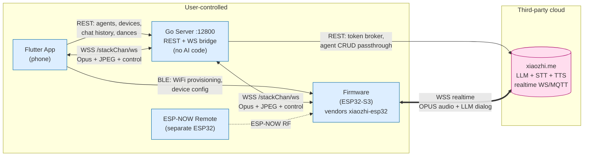

# 01 — System Overview

## Repository layout

```
StackChan/
├── firmware/    ESP32-S3 firmware for the M5Stack CoreS3-based robot
│                Vendors xiaozhi-esp32 (the actual AI runtime)
├── server/      Go (GoFrame v2) backend on port :12800
│                REST control plane + WS device↔app bridge
├── app/         Flutter mobile app (iOS / Android / macOS)
│                Provisioning, agent config, avatar/dance UI
├── remote/      ESP-NOW remote-control firmware (separate ESP32 device)
│                Out of scope for AI/voice — pure RF remote
└── docs/architecture/   ← this folder
```

## Component diagram



The bold double-line is the **AI hot path**. Everything else is control or
out-of-band data.

## Where each responsibility lives

| Concern | Firmware | Go Server | Flutter App | xiaozhi.me |
| --- | :-: | :-: | :-: | :-: |
| Mic capture, speaker playback | ✓ | | | |
| Wake-word detection (esp-sr) | ✓ | | | |
| Audio DSP (AEC, NS, VAD) | ✓ | | | |
| Opus encode/decode | ✓ | (relay only) | (scaffolded, unused) | ✓ |
| **STT (speech → text)** | | | | **✓** |
| **LLM (chat)** | | | | **✓** |
| **TTS (text → speech)** | | | | **✓** |
| MCP tool dispatch on device | ✓ | | | |
| Agent config (prompt, voice, model) | | (passthrough) | (UI) | ✓ (storage) |
| Avatar rendering (eyes, mouth) | ✓ | | (3D preview) | |
| Servo motion / dance | ✓ | | (UI) | |
| Device pairing, OTA, license | ✓ | (broker) | (UI) | ✓ |
| Phone↔device call/screen-share | ✓ | (relay) | ✓ | |
| User accounts, social feed | | ✓ | ✓ | |

The **only** AI-bearing column is xiaozhi.me. Replacing xiaozhi means
replacing the entire `[STT, LLM, TTS]` row.

## Two independent WebSocket planes

A common point of confusion: there are **two** WebSocket connections
running in parallel from the firmware.

| WS plane | Endpoint | Carries | Defined in |
| --- | --- | --- | --- |
| **AI plane** | `wss://*.xiaozhi.me/...` (or MQTT alternative) | Opus audio, LLM JSON state, MCP tool calls | `xiaozhi-esp32/main/protocols/{websocket,mqtt}_protocol.cc` |
| **Companion plane** | `wss://<go-server>/stackChan/ws?deviceType=StackChan` | Opus, JPEG, avatar/motion control, calls, dance | `firmware/main/hal/hal_ws_avatar.cpp` ↔ `server/internal/web_socket/web_socket.go` |

The Go server is **only** the second plane. It never sees AI traffic.

## Reading order

1. **Start here** — you just read it.
2. [`05-ai-voice-pipeline.md`](./05-ai-voice-pipeline.md) — for an
   end-to-end trace of one voice turn.
3. [`02-firmware.md`](./02-firmware.md) — for the device-side details.
4. [`06-mistral-migration.md`](./06-mistral-migration.md) — for the swap
   plan.
5. [`03-server.md`](./03-server.md) and [`04-app.md`](./04-app.md) — for
   completeness; mostly unaffected by the swap.
