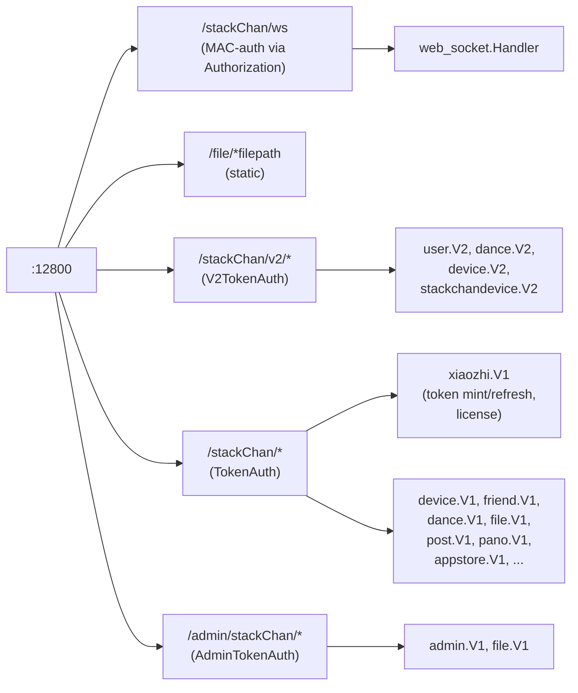

# 03 — Go Server

## Role

The Go server (`server/`) is **two unrelated planes** rolled into one
process on `:12800`:

1. **REST control plane** — token broker for `xiaozhi.me`, plus local
   data CRUD (devices, dances, social feed, accounts, app catalog).
2. **WebSocket bridge** — `/stackChan/ws` relays opaque binary frames
   (Opus audio, JPEG video, control) between the firmware and the phone
   App. **No AI code, no audio processing.**

Tech stack: GoFrame v2 (`github.com/gogf/gf/v2`), `gorilla/websocket`,
`golang-jwt/jwt`, MySQL.

## Routing



Source: `server/internal/cmd/cmd.go:38-71` (boot wiring) and
`server/main.go` (entry point).

## REST API surface

| Group | Endpoints | Purpose |
| --- | --- | --- |
| `xiaozhi/v1` | `GET /xiaozhi/token`, `/token/refresh`, `/generateLicenseToken` | Hand the device a bearer token for `xiaozhi.me` + provisioning license |
| `device/v1` | CRUD `/device`, `/device/info`, `/device/random` | Local device records |
| `device/v2` | `GET /devices`, `POST /device/bind`, `/device/unbind`, `/device/agent/restore` | User↔device binding; agent restore |
| `stackchandevice/v2` | `GET /device/user`, `POST /device/unbind` | Device-side variants (auth as device, not user) |
| `dance/v1,v2` | `/dance`, `/danceData`, `/musicList` | Dance assets |
| `pano/v1` | `POST/GET /pano` | 360° photos |
| `post/v1` | post + comment CRUD | Social feed |
| `friend/v1` | `/friend` add | Social graph |
| `file/v1` | upload | Generic file upload |
| `appstore/v1` | `GET /apps` | Mini-app catalog |
| `user/v2` | `GET /user`, register, login | User auth (JWT) |
| `admin/v1` | login, app CRUD | Admin console |

## xiaozhi integration in the server

`server/internal/xiaozhi/xiaozhi.go` (532 lines) is a **REST client** to
`https://xiaozhi.me/`:

```go
// xiaozhi.go:37
baseUrl = "https://xiaozhi.me/"

// xiaozhi.go:341  refreshToken — exchanges secret_key for 24h bearer
POST api/developers/token

// xiaozhi.go:184  CreateAgent
// xiaozhi.go:218  SetAgentSetting (LLM model, TTS voice, language, character...)
// + endpoints for: agents, agents/{id}/config, agents/{id}/devices,
//   developers/devices, developers/unbind-device,
//   developers/agent-templates/list, chats/list
```

Controllers `server/internal/controller/xiaozhi/`:

```
xiaozhi_v1_get_xiao_zhi_token.go              ← device requests bearer token
xiaozhi_v1_refresh_token.go                   ← refresh
xiaozhi_v1_get_xiao_zhi_generate_license_token.go ← provisioning license
xiaozhi.go, xiaozhi_new.go                    ← controller wiring
```

`server/internal/service/agent.go` calls `xiaozhi.SetAgentSetting`
(line 73) — it persists agent config and pushes it to xiaozhi.me. **It
never invokes an LLM itself.**

**No audio ever flows through this server to xiaozhi.** Tokens go out;
the firmware then opens its own realtime connection directly to
xiaozhi.me.

## WebSocket bridge protocol — `/stackChan/ws`

Custom **binary framing** over `gorilla/websocket`
(`server/internal/web_socket/web_socket.go:28-65`):

```
[1 byte msgType][4 byte BE uint32 length][N bytes payload]
```

Auth: header `Authorization` = base64( RSA-encrypted
`"MAC|...|unix_ts"` ), ±10s window
(`web_socket.go:79-105`). Query param `deviceType=StackChan|App` selects
the pool.

| Code | Name | Direction | Payload |
| --- | --- | --- | --- |
| `0x01` | Opus | both | raw opus frame (App→Device prefixes 12-byte MAC) |
| `0x02` | Jpeg | both | JPEG frame for camera/screen-share |
| `0x03` | ControlAvatar | App→Device | binary control |
| `0x04` | ControlMotion | App→Device | binary control |
| `0x05`/`0x06` | OnCamera / OffCamera | bidir | subscribe/unsubscribe |
| `0x07` | TextMessage | bidir | UTF-8 text |
| `0x09`–`0x0C` | RequestCall / Refuse / Agree / Hangup | bidir | call signaling |
| `0x0D`/`0x0E` | Update/GetDeviceName | bidir | nickname mgmt |
| `0x10`/`0x11` | ping / pong | bidir | heartbeat (15s timeout — `socket_task.go:24`) |
| `0x12`/`0x13` | On/OffPhoneScreen | bidir | mirror phone to device |
| `0x14` | Dance | App→Device | trigger dance |
| `0x15` | GetAvatarPosture | App→Device | query pose |
| `0x16`/`0x17` | Device Offline / Online | server→App | status broadcast |
| `0x18`/`0x19` | OnAudio / OffAudio | bidir | audio stream subscribe |
| `0x1A` | AimedTakePhoto | App→Device | targeted photo |

The server is a **router/forwarder** — Opus & JPEG frames are switched
between firmware and subscribed App clients. Nothing is decoded.

`server/internal/web_socket/socket_task.go` (322 lines) drives the
heartbeat (`StartPingTime`) and stale-connection GC
(`CheckExpiredLinks`).

## Dependencies (`server/go.mod`)

```
github.com/gogf/gf/v2 v2.10.0           — web framework
github.com/gorilla/websocket v1.5.3     — WS transport
github.com/golang-jwt/jwt/v5 v5.3.1     — REST auth
mysql driver
```

**No opus codec, no openai/AI SDK, no STT/TTS lib.** Adding any of those
would be net-new dependencies (and `opus` requires CGo + libopus).

## Flow overview

```
┌──────────────┐   /xiaozhi/token            ┌─────────────┐  /api/developers/token
│  Firmware    │ ─────────────────────────▶  │ Go Server   │ ─────────────────▶ xiaozhi.me
│              │ ◀── bearer ────────────────│ :12800       │ ◀── bearer ────── (cloud)
│              │                             └─────────────┘
│              │
│              │ ════ direct WSS to xiaozhi.me (Opus + LLM JSON) ═══════════▶ xiaozhi.me
│              │
│              │ ─── WSS /stackChan/ws ───▶  Go Server ───▶ App (relay)
│              │     (Opus 0x01, JPEG 0x02,                  (no AI)
│              │      calls, control, presence)
└──────────────┘
                                 ┌──────────────┐
                                 │ Companion App│ ◀═ same /stackChan/ws bridge
                                 └──────────────┘
```

## [MISTRAL] What changes here

If the firmware keeps talking to xiaozhi.me directly: **nothing
required**. The server is irrelevant to the AI plane today.

If you re-target the firmware so the server **becomes** the AI gateway,
then:

| File:Line | Currently | Repurpose for Mistral |
| --- | --- | --- |
| `internal/cmd/cmd.go:44` `s.BindHandler("/stackChan/ws", ...)` | Firmware↔App bridge | Add `/stackChan/ai` WS or branch on `deviceType=AI` to pipe Opus → STT → chat → TTS → Opus |
| `internal/web_socket/web_socket.go:411` `case Opus:` (StackChan branch) | Forwards opus to App subs | Tee opus into a per-MAC AI session (decode opus → PCM → Mistral STT) |
| `internal/web_socket/web_socket.go:600` `case TextMessage:` (App branch) | App-to-device text relay | Route into Mistral chat completions for typed input |
| `internal/web_socket/web_socket.go:805` `createMessage(Opus, data)` | Frame builder | Wrap Mistral TTS audio (after opus encode) for return path |
| `internal/xiaozhi/xiaozhi.go:37` `baseUrl` | xiaozhi.me REST | Point at Mistral or stub with local impl |
| `internal/xiaozhi/xiaozhi.go:184/218` `CreateAgent`/`SetAgentSetting` | Mirror agent into xiaozhi | Persist locally; have your AI handler read it per session |
| `internal/controller/xiaozhi/xiaozhi_v1_get_xiao_zhi_token.go:16` | Returns xiaozhi bearer | Return a JWT for your new realtime WS |
| `internal/controller/xiaozhi/xiaozhi_v1_get_xiao_zhi_generate_license_token.go:18` | License endpoint | Point firmware at your gateway |

**Net-new dependencies** if the server is to handle audio:
- Opus codec (`github.com/hraban/opus` — CGo + libopus)
- Mistral SDK / HTTP client for `chat/completions`, audio STT, audio TTS
- Per-session conversation state machine (xiaozhi holds it today;
  `service/agent.go` only configures, never invokes)
