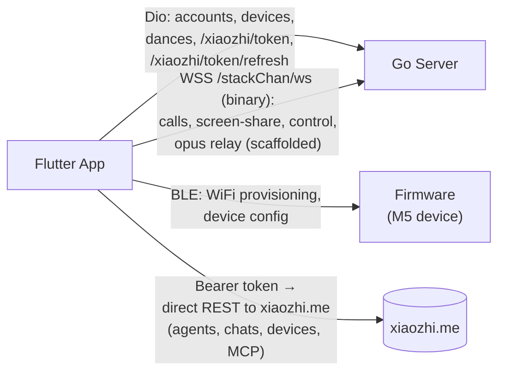

# 04 — Flutter Mobile App

## Role

Management and provisioning UI. Talks to the **Go server** for accounts,
devices, dances, and tokens; talks **directly to `xiaozhi.me`** for
agent CRUD and chat history.

**The phone has no live voice loop.** Audio scaffolding (Opus encoder,
PCM playback channel) exists but is unused for AI conversation — the
firmware handles voice.

## Directory layout

```
app/lib/
├── main.dart, app_state.dart
├── model/
│   ├── XiaoZhi/                   ← 25 DTOs for xiaozhi.me API
│   │   (agent, agent_create, agent_template, agents_device,
│   │    agents_devices_activate, conversation, conversation_message_data,
│   │    device, License, generateLicense, endpoints_response,
│   │    mcp_endpoints, common_mcp_tool, product, tts_list,
│   │    xiaozhi_model, pagination)
│   ├── dance_list.dart, expression_data.dart, model.dart, ...
├── network/
│   ├── http.dart                  ← Dio wrapper for LOCAL backend
│   └── urls.dart                  ← Endpoint constants
├── util/
│   ├── XiaoZhi_util.dart          ← REST client targeting xiaozhi.me
│   ├── audio_engine_manager.dart  ← Opus 16kHz mono encoder/decoder
│   ├── native_bridge.dart         ← MethodChannel: com.m5stack.stackchan/native
│   ├── blue_util.dart             ← BLE provisioning of M5 device
│   ├── music_util.dart            ← just_audio playback (music only)
│   ├── ml_kit_util.dart           ← Face detection
│   └── rsa_util.dart, mac_address_validator.dart, ...
└── view/
    ├── home/                      home, stack_chan, settings, avatar,
    │                              dance, dance_list_page, record_dance,
    │                              conversation_page, mcp_page,
    │                              monitoring_camera, pano_page
    ├── popup/                     xiaozhi_welcome_page, edit_agent,
    │                              agent_configuration,
    │                              conversation_message_page, binding_device,
    │                              select_blue_device, device_wifi_config,
    │                              device_name_page, login_page,
    │                              user_info_page, motion, ...
    └── util/                      stackchan_robot_box (3D avatar),
                                    stack_chan_face_view, scan_view,
                                    grid_coordinate_joystick, ...
```

## Where it talks to what



`app/lib/util/XiaoZhi_util.dart:38`:

```dart
_dio.options.baseUrl = "https://XiaoZhi.me/";
```

The bearer token is bootstrapped via the local server
(`urls.dart:130-138` → `xiaozhi/token` and `xiaozhi/token/refresh`),
then sent as `Bearer` directly to xiaozhi.me. So the local server is an
**OAuth-style token broker**; all subsequent REST traffic bypasses it.

## XiaoZhi REST methods (~30 in `XiaoZhi_util.dart`)

| Category | Endpoints (xiaozhi.me) |
| --- | --- |
| Agents | `api/agents`, `api/agents/{id}`, `api/agents/{id}/config`, `api/agents/{id}/devices`, `api/developers/agent-templates/list` |
| Devices | `api/developers/devices`, `api/developers/unbind-device`, `api/developers/generate-license`, `api/agents/devices/activate` |
| Catalog | `api/developers/products/list`, `api/developers/products/{id}/licenses`, `api/user/tts-list`, `api/roles/model-list`, `api/agents/common-mcp-tool/list` |
| MCP | `api/developers/mcp-endpoints` (CRUD), `api/agents/{id}/generate-mcp-endpoint-token` |
| Conversations (READ-ONLY) | `api/chats/list`, `api/chats/messages`, DELETE `api/agents/{id}/chats/{id}` |

## Audio in the app

| Component | Status |
| --- | --- |
| `AudioEngineManager` (Opus 16kHz mono, frame=320) | Initialized; encoder + decoder ready |
| Recording stream from native (`recordChannel`) | **Commented out** (`audio_engine_manager.dart:58-60`, `native_bridge.dart:25-27`) |
| Playback path (`sendAudioStream` PCM → native) | Functional |
| `just_audio` (music_util.dart) | Used for music playback only |
| `flutter_tts` / direct STT/TTS APIs | **Not present** |

Voice scaffolding exists but is not wired to a conversation flow.

## Conversation-related screens

| File | Role |
| --- | --- |
| `view/home/conversation_page.dart` | Lists past chats (`XiaoZhiUtil.getConversationList`) |
| `view/popup/conversation_message_page.dart` | Renders chat history (`getChatsMessages`) |
| `view/popup/edit_agent.dart` | Agent prompt / voice / model config |
| `view/popup/agent_configuration.dart` | Bind/unbind device to agent |
| `view/popup/xiaozhi_welcome_page.dart` | Onboarding |

All are history viewers + config UI. **No live voice UI.**

## [MISTRAL] What changes here

**Live voice path: zero app changes.** It lives on the firmware.

**Management/history path: significant work in `XiaoZhi_util.dart` and
~8 view files**:

| Required change | Location |
| --- | --- |
| Remove direct `xiaozhi.me` baseUrl; route through local server | `util/XiaoZhi_util.dart:38` |
| Replace 30 endpoint paths (`api/agents`, `api/chats/messages`, …) | `util/XiaoZhi_util.dart:171-720` |
| Drop license / device-activation flow (xiaozhi-specific) | `util/XiaoZhi_util.dart:465-540`, `view/popup/select_blue_device.dart:275-292` |
| Adapt `XiaozhiResponse<T>` envelope if Mistral-backed server differs | `util/XiaoZhi_util.dart:733` |
| Remove token broker calls if not needed | `urls.dart:130-138`, `XiaoZhi_util.dart:143-167` |
| Rename ~25 DTOs under `model/XiaoZhi/` | full directory |
| Update view files importing `XiaoZhi_util` / models | `view/popup/{edit_agent, agent_configuration, conversation_message_page, select_blue_device, device_name_page}.dart`, `view/home/{conversation_page, settings}.dart` |

**Cleanest path**: keep DTOs and method signatures; replace only the
baseUrl + endpoint paths so the local server proxies to Mistral. That
isolates the change to ~50 lines in `XiaoZhi_util.dart`.
