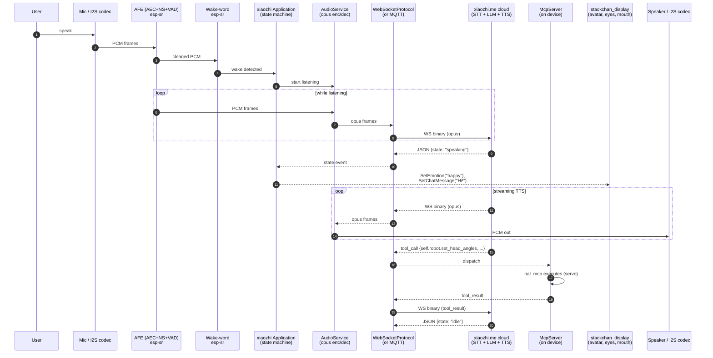

# 05 — AI / Voice Pipeline (end-to-end)

## One voice turn, traced



## Components by layer

```
┌────────────────────────────────────────────────────────────────────┐
│  ESP32-S3 (firmware)                                               │
│                                                                    │
│  ┌──────────────┐  ┌──────────────┐  ┌─────────────────────────┐   │
│  │ Mooncake UI  │  │ StackChan    │  │ xiaozhi-esp32 runtime   │   │
│  │ (launcher,   │  │ avatar +     │  │  ┌──────────┐           │   │
│  │  apps, HAL)  │  │ motion lib   │  │  │ Application+SM       │   │
│  └──────┬───────┘  └──────▲───────┘  │  └────┬─────┘           │   │
│         │                 │          │       ▼                 │   │
│         │ requestXiaozhi  │          │  ┌──────────┐           │   │
│         │   Start()       │          │  │AudioServ │           │   │
│         ▼                 │          │  │ +Codec+  │           │   │
│   ┌──────────────────┐    │          │  │ Opus +   │           │   │
│   │ HAL (servo, IMU, │────┘          │  │ AEC/NS   │           │   │
│   │  BLE, WiFi,      │   signals     │  └────┬─────┘           │   │
│   │  ws_avatar,      │               │       ▼                 │   │
│   │  hal_mcp,        │               │  ┌──────────┐           │   │
│   │  hal_bridge)     │               │  │WS/MQTT   │ ════ to ══╪══▶│
│   └──────────────────┘               │  │ Protocol │  xiaozhi.me   │
│                                      │  └──────────┘               │
│                                      │  ┌──────────┐               │
│                                      │  │McpServer │←──registers── │
│                                      │  └──────────┘               │
│                                      └─────────────────────────────┤
│                                                                    │
│  hal_ws_avatar.cpp  ════ companion-server WS ══════════════════▶ Go│
│                          (Opus, JPEG, control — NOT AI)            │
└────────────────────────────────────────────────────────────────────┘
```

## What runs where

| Stage | Where | Code |
| --- | --- | --- |
| Mic + speaker (I2S) | Firmware | `xiaozhi-esp32/main/audio/codecs/*` |
| AEC + NS + VAD | Firmware | `xiaozhi-esp32/main/audio/processors/afe_audio_processor.cc` (uses `esp-sr`) |
| Wake-word | Firmware | `xiaozhi-esp32/main/audio/wake_words/{afe,custom,esp}_wake_word.cc` (uses `esp-sr`) |
| Opus encode (mic→cloud) | Firmware | `xiaozhi-esp32/main/audio/audio_service.cc` + `espressif/esp_audio_codec` |
| Wire transport | Firmware | `xiaozhi-esp32/main/protocols/{websocket,mqtt}_protocol.cc` |
| **STT** | **xiaozhi.me cloud** | — |
| **LLM** | **xiaozhi.me cloud** | — |
| **TTS** | **xiaozhi.me cloud** | — |
| Opus decode (cloud→speaker) | Firmware | same `audio_service.cc` |
| Avatar / chat-bubble | Firmware | `firmware/main/hal/board/stackchan_display.cc` (overrides xiaozhi `Display`) |
| Tool calls (function calling) | Firmware exec, cloud-orchestrated | `xiaozhi-esp32/main/mcp_server.cc` ↔ `firmware/main/hal/hal_mcp.cpp` |
| Server-discovery (boot) | Firmware → `OTA_URL` | `firmware/main/Kconfig.projbuild:5` |
| Device token / license | Firmware → Go server → xiaozhi.me | `internal/xiaozhi/xiaozhi.go:341` |
| Agent config (prompt, voice, model) | App / Server → xiaozhi.me | `XiaoZhi_util.dart` + `internal/service/agent.go:73` |
| Chat history | App → xiaozhi.me directly | `XiaoZhi_util.dart` `getConversationList` / `getChatsMessages` |

## The MCP loop (function calling)

xiaozhi's protocol carries MCP messages so the cloud LLM can invoke
**device-side tools**:

```
hal_mcp.cpp registers:
    self.robot.get_head_angles()  → returns [yaw, pitch]
    self.robot.set_head_angles(yaw, pitch)
                ↓ on boot, into McpServer (xiaozhi-esp32/main/mcp_server.cc)
                ↓
LLM (xiaozhi.me) decides to call self.robot.set_head_angles(30, 0)
                ↓ over WS
McpServer.dispatch → hal_mcp callback → hal_servo.cpp
                ↓
Result back over WS to LLM
```

Any Mistral replacement must reproduce this loop or accept that the LLM
loses servo control. Mistral's **function calling** maps cleanly onto MCP
tool definitions, so this is mostly a translation problem (JSON schema +
dispatcher).

## The companion plane (NOT AI)

A separate, parallel WebSocket exists for the firmware ↔ phone
relationship via the Go server:

```
Firmware  ── WSS /stackChan/ws ──▶  Go Server  ── WSS /stackChan/ws ──▶ App
                                    (relay only)
```

It carries Opus (call audio), JPEG (camera + screen-share), and binary
control (avatar, motion, dance). This plane has no LLM / STT / TTS and
does not need to change for a Mistral migration — but it does prove that
the firmware already knows how to:

- open a long-lived WSS to your own server
- send/receive Opus frames over a custom binary framing

That is convenient if you choose to make the Go server the new AI
gateway.

## Key takeaways for a Mistral swap

1. **All three of STT, LLM, TTS live in xiaozhi.me cloud.** None of
   them exist locally. Replacing "the AI" means replacing all three.
2. **The firmware is the only client of those services.** The phone
   App and the Go server only handle metadata, history, tokens, and
   relay. So the audio swap is a firmware change.
3. **The MCP tool-call loop must be preserved** if you want the LLM to
   keep moving the servos. Mistral function calling can carry this.
4. **The OTA URL / discovery hop is your secret weapon for a
   non-invasive partial swap.** Redirecting `OTA_URL` lets your own
   gateway tell the firmware where to dial — the firmware doesn't care
   if it's xiaozhi.me or your gateway, as long as the wire protocol
   matches (or your gateway translates).
