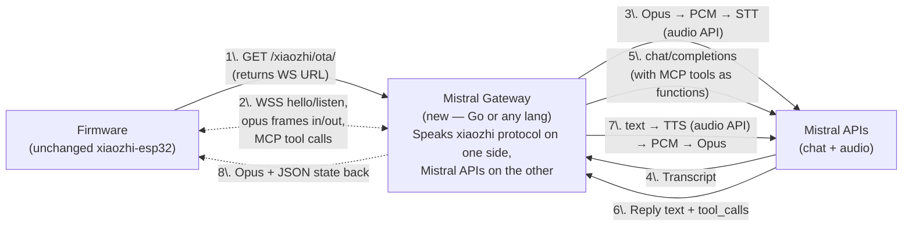
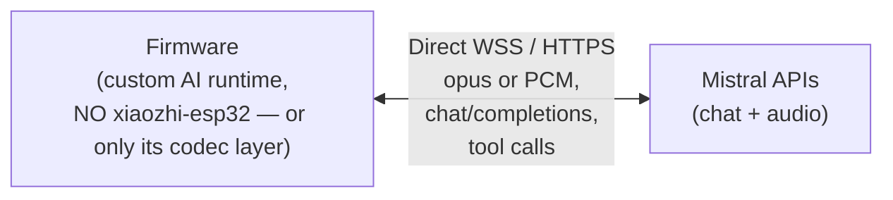

# 06 — Mistral Migration: Two Paths

> **STATUS — Path A shipped.** As of PR #1 (`feat/mistral-gateway`,
> merged into `main`), the entire Path A gateway is live and verified
> on real hardware: voice → STT → LLM with per-session memory + MCP
> function calls + camera/vision → expressive avatar + spoken reply.
> See `server/internal/mistral_gateway/` for the implementation and
> [`07-path-a-implementation.md`](./07-path-a-implementation.md) for
> the post-mortem milestone log. Path B remains the documented
> alternative if the gateway translation cost ever stops feeling
> worth it.

This doc compares **two realistic strategies** for replacing xiaozhi.me's
LLM + STT + TTS with Mistral's APIs. Both end at the same outcome (a
working voice assistant on the StackChan robot), but they differ
dramatically in effort, blast radius, and which parts of the existing
ecosystem you keep.

> **Premise**: xiaozhi.me provides LLM + STT + TTS over a custom realtime
> protocol (WS or MQTT). Mistral provides chat completions, audio STT,
> and audio TTS over standard HTTP/WebSocket APIs. We need a bridge.

## The two paths at a glance

| | **Path A — Partial swap** (gateway) | **Path B — Full firmware replacement** |
| --- | --- | --- |
| **Where the change happens** | Mostly **server-side** + small firmware redirect | Almost entirely **firmware-side** |
| **Firmware changes** | Redirect `OTA_URL`, optional protocol patch | Replace `start_xiaozhi_app()`; potentially rip out `xiaozhi-esp32` entirely |
| **Server changes** | Add Mistral gateway: realtime WS endpoint translating xiaozhi protocol ↔ Mistral APIs | Optional |
| **App changes** | Minimal (rebase `XiaoZhi_util.dart` URLs if you also re-host config) | Same as A |
| **Keeps xiaozhi-esp32 vendored** | Yes (intact) | No (or only the audio I/O parts) |
| **OTA, wake-word, audio I/O** | Untouched | You own them |
| **Effort estimate** | Medium (1 dev × few weeks; **actual: ~10 milestone commits, AI-paired, all in one focused sprint**) | High (1 dev × months; embedded C++ + protocol design) |
| **Risk** | Low — firmware is unchanged. Worst case: revert `OTA_URL`. | High — bricked devices, audio glitches, MCP bugs |
| **Maintainability** | Bound to xiaozhi protocol changes (vendor at v2.2.4) | You own the stack; no upstream churn |
| **Reuses Mistral standard APIs** | Yes (server uses `chat/completions`, audio APIs) | Yes (firmware does, more directly) |

## Path A — Partial swap via a translation gateway

### Architecture

### Implementation steps

1. **Build a Mistral gateway** that speaks the xiaozhi protocol. The
   wire-level reference lives in
   `firmware/xiaozhi-esp32/main/protocols/{websocket_protocol.cc,
   mqtt_protocol.cc, protocol.cc}` — start by replicating its message
   types: `hello`, `listen` start/stop, binary opus frames, `tts` state
   events, `mcp` JSON-RPC.
2. **Decode opus to PCM**, stream to Mistral STT.
3. **Run Mistral chat completions** with the agent's system prompt
   (loaded from your local DB, populated by the Flutter app via the
   existing CRUD endpoints).
4. **Translate MCP tool definitions to Mistral function-calling
   schema**. When the model returns `tool_calls`, forward as MCP
   JSON-RPC over the WS to the firmware; when the firmware replies with
   `tool_result`, feed back into the next chat turn.
5. **Stream Mistral TTS**, encode PCM → Opus (libopus), frame and
   send.
6. **Redirect the firmware to your gateway**: change the build's
   `CONFIG_OTA_URL` (`firmware/main/Kconfig.projbuild:5`) to your
   gateway's OTA endpoint. The OTA response payload (per
   `xiaozhi-esp32/main/ota.cc`) is what tells the firmware which
   WS/MQTT URL to dial. Your gateway returns its own URL.

### Pros

- **The firmware is essentially unchanged** — you can ship A/B builds
  by flipping a Kconfig.
- The Go server's existing `/stackChan/ws` and REST plane keep working
  for the App.
- You can co-locate the gateway with the existing Go server (single
  process) or run it standalone.
- Easier to debug: gateway is plain Go/Python you control, with logs
  on your terms.

### Cons

- You inherit the xiaozhi wire protocol (which is undocumented and
  pinned to v2.2.4 — see `firmware/dependencies.lock`). Any future
  xiaozhi-esp32 version bumps may shift the wire format.
- You pay an extra hop (Mistral chat is request/response, not
  realtime) — interactive latency depends on Mistral's audio APIs
  being streaming-capable. For lowest latency consider Mistral's
  streaming endpoints throughout.
- Server-side opus codec needs CGo + libopus (`go.mod` has none of
  this today).

### Concrete files to add / touch

The list below shows what we actually shipped (file names sometimes
diverge from the original plan — `chat.go` not `llm.go`, plus several
files we hadn't anticipated).

| Where | Change | Status |
| --- | --- | --- |
| `firmware/main/Kconfig.projbuild:5` | `default "https://api.tenclass.net/xiaozhi/ota/"` → your gateway (LAN IP at dev time) | done |
| `server/internal/cmd/cmd.go` | Bind `POST /xiaozhi/ota/`, `WS /xiaozhi/v1/`, `POST /xiaozhi/vision/explain` | done |
| `server/go.mod` | Adds `github.com/hraban/opus` (CGo + libopus), `github.com/gorilla/websocket`. No Mistral SDK — `net/http` directly | done |
| New: `server/internal/mistral_gateway/config.go` | Env-driven config (one place for every knob) | done |
| New: `server/internal/mistral_gateway/{ota.go, ws.go, session.go, framing.go, opus.go, audio_util.go}` | Wire layer | done |
| New: `server/internal/mistral_gateway/{stt.go, tts.go}` | Voxtral STT + buffered/streaming TTS | done |
| New: `server/internal/mistral_gateway/{chat.go, mcp.go, tools_map.go}` | Chat completions + JSON-RPC over WS + tool-call loop | done |
| New: `server/internal/mistral_gateway/{vision.go, vision_client.go}` | `/explain` HTTP endpoint + multimodal Pixtral call | done |
| New: `server/internal/mistral_gateway/emotion.go` | Inline `[emotion:NAME]` parser → device avatar event | done |
| New: `server/scripts/dev-gateway.sh` | LAN-IP autodetect, RSA key gen, env summary banner | done |
| `server/internal/web_socket/web_socket.go` | (Originally proposed extension — NOT touched. The gateway is a separate route group, decoupled from the existing companion plane) | skipped |
| `server/internal/xiaozhi/xiaozhi.go` | Untouched — the gateway has no dependency on the legacy xiaozhi REST plane | skipped |

## Path B — Full firmware replacement

### Architecture

### Implementation steps

1. **Decide what to keep from `xiaozhi-esp32`.** The high-value bits
   are audio I/O codecs, AFE/wake-word, and Opus encode/decode — all
   genuinely hard on ESP32. The replaceable bit is the
   `Application` + `Protocol` layer.
2. **Replace `start_xiaozhi_app()`** in
   `firmware/main/hal/board/hal_bridge.cc:99-109`. New body:
   - Initialize whichever audio codec / processor / wake-word stack
     you keep (you can still call into xiaozhi's classes directly
     since they're compiled in via `firmware/main/CMakeLists.txt`).
   - Open a WSS / HTTP/2 client to Mistral.
   - Run your own state machine (idle → listening → thinking →
     speaking).
3. **Reimplement the avatar/display callbacks**. xiaozhi's
   `Application` is what calls `Display::SetEmotion` and
   `Display::SetChatMessage`, which `stackchan_display.cc` overrides
   to drive the cute avatar. You must call these directly from your
   new state machine to keep the avatar reactive.
4. **Reimplement MCP tool dispatch**, or replace MCP entirely with
   Mistral function-calling on-device. `firmware/main/hal/hal_mcp.cpp`
   currently registers tools into xiaozhi's `McpServer` — re-route to
   your own function dispatcher.
5. **Build a tiny config plane**. The Go server today hands out
   xiaozhi tokens; you'd return Mistral API keys (or, better, a
   short-lived JWT scoped to your gateway).

### Pros

- **You own the stack end-to-end.** No xiaozhi protocol baggage.
- Lowest possible latency (one direct hop firmware ↔ Mistral).
- Free to re-design: e.g., always-on streaming with server-side VAD
  (skip wake-word), bidirectional realtime audio if Mistral exposes
  it.
- Frees you from `xiaozhi-esp32` upstream churn.

### Cons

- **Largest blast radius.** OTA flow, audio quality, AEC tuning,
  battery life, partition layout — all yours to verify.
- ESP32 development cycle (build → flash → test) is slow.
- You'll likely re-implement most of `audio_service.cc` even if you
  re-use the codec drivers.
- Updates require firmware OTA — slow rollout for fixes.

### Concrete files to touch

| Where | Change |
| --- | --- |
| `firmware/main/hal/board/hal_bridge.cc:99-109` | Replace `start_xiaozhi_app()` body with your own runtime |
| `firmware/main/hal/board/stackchan_display.cc` | Call avatar APIs from your state machine instead of xiaozhi `Application` |
| `firmware/main/hal/hal_mcp.cpp` | Swap MCP server registration for direct Mistral function dispatch |
| `firmware/main/apps/app_ai_agent/app_ai_agent.cpp:42` | Repoint or rename (cosmetic) |
| `firmware/main/CMakeLists.txt` | Drop `protocols/*` from xiaozhi sources; keep audio/codec/processor sources |
| New: `firmware/main/mistral/{client.cc, audio_loop.cc, state_machine.cc, tools.cc}` | Your own runtime |
| `firmware/repos.json` | Optional: drop `xiaozhi-esp32` clone if you've vendored only what you need |

## Hybrid you should probably consider

In practice the cleanest middle ground is:

> **"Path A first, then optionally Path B for future-proofing."**

- Ship Path A (gateway) end-to-end. You learn the wire protocol, you
  validate Mistral STT/TTS quality, you verify MCP-as-function-calls
  works on your model.
- Once stable, decide whether the protocol-translation cost is worth
  paying long-term. If not, attack Path B incrementally — swap
  `Protocol` first, then `Application`.

This staged approach gets you to a working Mistral-powered StackChan in
weeks rather than months, and de-risks the embedded work.

## Decision checklist

Pick **Path A** if any of these hold:

- You want a working demo soon.
- You don't want to maintain the firmware long-term.
- You expect to keep upgrading `xiaozhi-esp32` (for audio improvements,
  new boards, etc.).
- Your team has more server expertise than embedded C++.

Pick **Path B** if any of these hold:

- Latency / privacy / offline-mode is critical.
- You want a fully Mistral-branded firmware with no xiaozhi traces.
- You're prepared to own the full embedded stack including OTA.
- You'd rather not introduce a new always-on backend service.

## Cross-cutting concerns regardless of path

| Concern | Notes (post-shipment for Path A) |
| --- | --- |
| **MCP tools** | StackChan exposes 11 tools today (head angles, LED, reminders, camera, plus several from upstream xiaozhi-esp32). Mapping to Mistral function-calling is direct — `tools_map.go` keeps `inputSchema` as raw JSON so it round-trips verbatim. The chat-tool loop runs in a goroutine so the WS reader stays free to deliver MCP responses. |
| **Wake-word** | Stayed on-device. The "Hi StackChan" model (`wn9_histackchan_tts3`) lives in `sdkconfig.defaults`. Wake-word triggers `listen:detect` which we treat identically to `listen:start`. |
| **Opus** | `github.com/hraban/opus` works (`brew install opus opusfile pkg-config` on macOS). One footgun documented in `opus.go`: `Decode/Encode` alias an internal buffer — callers MUST copy. |
| **Agent config** | Currently env-driven (one global system prompt per gateway process). Per-MAC DB-backed config is the M11 wishlist item. |
| **License / activation** | OTA returns an empty `activation` block; the device skips the code-entry flow. The patched firmware (`firmware/patches/xiaozhi-esp32.patch`) already accepts this. |
| **Companion plane** | `/stackChan/ws` between firmware and Go server (Opus/JPEG/control for the App) is unaffected — confirmed at runtime, no interaction with the gateway. |
| **OTA firmware updates** | xiaozhi's `ota.cc` still handles firmware OTA. The gateway's `/xiaozhi/ota/` returns the WS URL only; firmware-OTA upgrade URLs would be a future extension. |
| **TTS streaming reality** | Voxtral's "stream" mode is mostly buffered server-side: first audio chunk arrives at ~3 s TTFA carrying ~400 ms of audio, rest streams at near-real-time. So streaming doesn't move TTFA much vs buffered, but it's still worth keeping for resilience (the 5xx retry hides transient `unreachable_backend` errors). |
| **Vision** | Device's `take_photo` MCP tool POSTs JPEG + question to a separate `POST /xiaozhi/vision/explain` HTTP endpoint we run. Per-session bearer token sent via MCP `initialize.capabilities.vision.{url, token}`. Empty question → save-only; non-empty → Pixtral analysis. |
| **Emotion** | Inline `[emotion:NAME]` tags in the LLM reply, parsed gateway-side, sent to the device as `{type:"llm",emotion:NAME}` before TTS, stripped from the spoken text. Allowlist matches the firmware's `SetEmotion` switch. |

## Quick reference — all swap points in one table

| # | File | Path A touches? | Path B touches? |
| --- | --- | --- | --- |
| 1 | `firmware/main/hal/board/hal_bridge.cc:99-109` | No | **Yes** (replace) |
| 2 | `firmware/main/Kconfig.projbuild:5` (`OTA_URL`) | **Yes** (redirect) | Maybe (point to your provisioning) |
| 3 | `firmware/xiaozhi-esp32/main/protocols/*` | No (gateway speaks the protocol) | **Yes** (drop / rewrite) |
| 4 | `firmware/xiaozhi-esp32/main/audio/audio_service.cc` | No | Maybe (likely re-used as-is) |
| 5 | `firmware/main/hal/hal_mcp.cpp` | No | **Yes** (swap dispatch) |
| 6 | `firmware/main/hal/hal_ws_avatar.cpp` | No | No |
| 7 | `firmware/xiaozhi-esp32/main/audio/wake_words/*` | No | Maybe (drop if always-on) |
| 8 | `firmware/main/apps/app_ai_agent/app_ai_agent.cpp:42` | No | Cosmetic |
| 9 | `firmware/main/hal/board/stackchan_display.cc` | No | **Yes** (call from your loop) |
| 10 | `server/internal/web_socket/web_socket.go` (Opus / TextMessage cases) | **Yes** (new AI branch) | No |
| 11 | `server/internal/cmd/cmd.go:44` (route bind) | **Yes** (add `/stackChan/ai`) | No |
| 12 | `server/internal/xiaozhi/xiaozhi.go:37` baseUrl | **Yes** (stub or re-target) | Maybe |
| 13 | `server/internal/controller/xiaozhi/xiaozhi_v1_get_xiao_zhi_token.go` | **Yes** (return your JWT) | Maybe |
| 14 | `server/go.mod` (add opus, mistral SDK) | **Yes** | No |
| 15 | `app/lib/util/XiaoZhi_util.dart:38` baseUrl | Optional | Optional |
| 16 | `app/lib/util/XiaoZhi_util.dart:171-720` endpoint paths | Optional | Optional |
