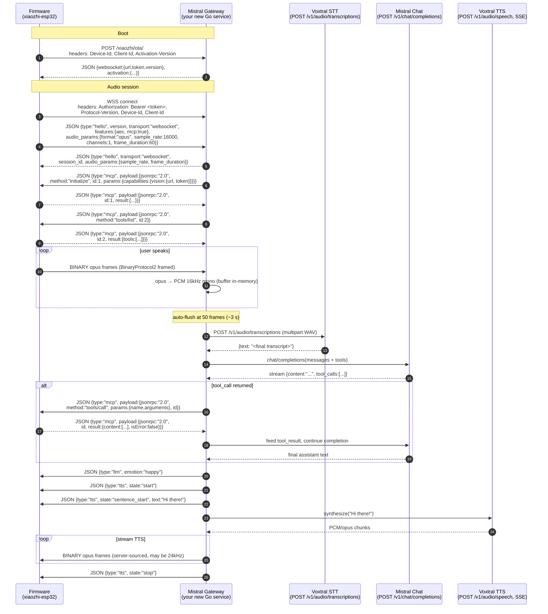

# 07 — Path A: Detailed Implementation Plan

> **STATUS — Shipped (PR #1).** This doc was originally a build guide;
> it now doubles as a post-mortem. Sections marked **(SHIPPED)** describe
> what landed; sections marked **(PLANNED)** are forward-looking. The
> milestone table near the end has both the original plan and what
> actually happened side by side.

> Build a **xiaozhi-protocol-speaking gateway** that translates to Mistral
> APIs, then redirect the firmware to it via `OTA_URL`. Firmware code
> stays untouched.

This doc gives you everything you need to start building. Wire-protocol
details are sourced from `78/xiaozhi-esp32` (the upstream repo vendored
at `firmware/xiaozhi-esp32/` via `firmware/repos.json`).

## Mistral building blocks (as of 2026)

What we actually used in the shipped gateway, in the order each
appears in a single user turn:

| Need | Mistral product (used) | Endpoint | Notes |
| --- | --- | --- | --- |
| STT (batch) | **Voxtral Mini latest** | `POST /v1/audio/transcriptions` | We send WAV multipart after auto-flush (~3 s of buffered audio). Realtime/streaming STT was on the table but batch turned out to be plenty fast (~250-350 ms per 3 s clip) |
| LLM | **`mistral-small-latest`** by default, configurable | `POST /v1/chat/completions` | Function-calling for MCP tools; per-session history (last 6 messages = 3 exchanges) |
| TTS | **`voxtral-mini-tts-2603`** | `POST /v1/audio/speech` | Both buffered (WAV) and streaming (SSE / `pcm`) paths. See "TTS streaming reality" caveat in `06-mistral-migration.md` |
| Vision | **`mistral-medium-latest`** by default, configurable | `POST /v1/chat/completions` (multimodal) | JPEG embedded inline as base64 data URL. Used by the `/xiaozhi/vision/explain` HTTP endpoint when the device's `take_photo` MCP tool fires with a non-empty question |

API base: `https://api.mistral.ai/v1`. Docs:
[Speech to Text](https://docs.mistral.ai/studio-api/audio/speech_to_text),
[Voxtral overview](https://mistral.ai/news/voxtral),
[Vision](https://docs.mistral.ai/capabilities/vision).

## End-to-end gateway architecture



## Wire protocol cheat sheet (xiaozhi-esp32 v2.2.4)

### OTA discovery

```
POST <CONFIG_OTA_URL>            (default: https://api.tenclass.net/xiaozhi/ota/)
Headers:
  Activation-Version: 1 | 2
  Device-Id:          <MAC address>
  Client-Id:          <UUID>
  Serial-Number:      <optional>
  User-Agent:         <board user-agent>
  Accept-Language:    <lang>
  Content-Type:       application/json

Body: device system info JSON (mac, chip, app version, board, ...)

Response 200:
{
  "websocket": {
    "url":     "wss://your.gateway/xiaozhi/v1/",
    "token":   "<opaque bearer>",
    "version": 2                          // BinaryProtocol version: 1, 2, or 3
  },
  "mqtt": { ... },                        // optional alternative transport
  "activation": {
    "message":    "<text shown to user>",
    "code":       "<6-digit activation code>",
    "challenge":  "<HMAC challenge>",
    "timeout_ms": 60000
  },
  "firmware": { "version": "...", "url": "..." }   // optional OTA
}
```

The `websocket.url` and `token` are persisted to NVS. Your gateway
controls which WS the device dials by what it returns here.

### WebSocket connect headers

```
Authorization:    Bearer <token from OTA response>
Protocol-Version: 1                       // matches BinaryProtocol version
Device-Id:        <MAC>
Client-Id:        <UUID>
```

### Hello handshake

Client → Server (first text frame):

```json
{
  "type": "hello",
  "version": 1,
  "transport": "websocket",
  "features": { "aec": true, "mcp": true },
  "audio_params": {
    "format": "opus",
    "sample_rate": 16000,
    "channels": 1,
    "frame_duration": 60
  }
}
```

Server → Client (must arrive within 10 s or device aborts):

```json
{
  "type": "hello",
  "transport": "websocket",
  "session_id": "<your-uuid>",
  "audio_params": {
    "sample_rate": 16000,
    "frame_duration": 60
  }
}
```

### Binary audio frames

Pick one based on your `OTA.websocket.version`. Recommendation:
**version 2** (timestamps help server-side AEC).

| Version | Layout |
| --- | --- |
| 1 | Raw opus payload, no header |
| **2** | `uint16 version, uint16 type (0=OPUS, 1=JSON), uint32 reserved, uint32 timestamp_ms, uint32 payload_size, payload[]` (all big-endian) |
| 3 | `uint8 type, uint8 reserved, uint16 payload_size, payload[]` |

Audio: **16 kHz mono, 16-bit, 60 ms frames, Opus VBR + DTX, FEC off**.
Server-sent TTS may be at **24 kHz**.

### Server → device JSON message types

| `type` | Fields | Effect |
| --- | --- | --- |
| `tts` | `state: "start" \| "stop" \| "sentence_start"`, `text?` | Drive avatar speaking state + chat bubble |
| `stt` | `text` | (Optional) Echo final transcription back for display |
| `llm` | `emotion` | Drive avatar emotion (`happy`, `neutral`, `sad`, ...) |
| `mcp` | `payload` (JSON-RPC 2.0) | Tool calls / tool list |
| `system` | `command: "reboot"` | Misc commands |
| `alert` | `status, message, emotion` | Modal alert UI |
| `iot` | (deprecated, replaced by `mcp`) | Skip |

### MCP message envelope

Server → device (call a tool the device exposed):

```json
{
  "session_id": "<from hello>",
  "type": "mcp",
  "payload": {
    "jsonrpc": "2.0",
    "method": "tools/call",
    "params": {
      "name": "self.robot.set_head_angles",
      "arguments": { "yaw": 30, "pitch": 0 }
    },
    "id": 42
  }
}
```

Device → server (result):

```json
{
  "session_id": "<...>",
  "type": "mcp",
  "payload": {
    "jsonrpc": "2.0",
    "id": 42,
    "result": {
      "content": [{ "type": "text", "text": "ok" }],
      "isError": false
    }
  }
}
```

To **discover** the tools the device exposes, your gateway sends:

```json
{ "type": "mcp",
  "payload": { "jsonrpc": "2.0", "method": "tools/list", "id": 1 } }
```

Device returns a paginated list of `{ name, description, inputSchema, annotations? }`.

## Mapping MCP ↔ Mistral function calling

Direct mapping. Mistral uses OpenAI-style function specs:

```python
# What the device returns from tools/list:
{
  "name": "self.robot.set_head_angles",
  "description": "Set the head yaw and pitch angles",
  "inputSchema": {
    "type": "object",
    "properties": {
      "yaw":   { "type": "integer" },
      "pitch": { "type": "integer" }
    },
    "required": ["yaw", "pitch"]
  }
}

# What Mistral chat/completions expects in `tools`:
{
  "type": "function",
  "function": {
    "name": "self.robot.set_head_angles",  # keep dotted name as-is
    "description": "...",
    "parameters": <inputSchema verbatim>
  }
}
```

When Mistral returns `tool_calls[].function.arguments` (a JSON string),
parse it and forward as the MCP `tools/call` shown above. When the
device returns the MCP `result`, append a `tool` role message to the
Mistral conversation:

```json
{ "role": "tool",
  "tool_call_id": "<from Mistral>",
  "name": "self.robot.set_head_angles",
  "content": "ok" }
```

Then continue the completion to get the assistant's natural-language
reply.

## Gateway component breakdown

```
server/internal/mistral_gateway/
├── ota.go              Implements POST /xiaozhi/ota/  (returns ws URL)
├── ota.go              POST /xiaozhi/ota/ — returns the WS URL + token
├── ws.go               WSS upgrader, hello exchange, per-session loop, dispatch
├── framing.go          BinaryProtocol2 encode/decode (16-byte big-endian header)
├── opus.go             libopus wrapper (CGo via hraban/opus); decode/encode 16 kHz
├── audio_util.go       WAV encode/decode, resample, peak-normalize, frame split,
│                       float32 LE → int16 (for streaming TTS)
├── stt.go              Voxtral STT client — multipart WAV upload (batch)
├── tts.go              Voxtral TTS client — buffered WAV AND streaming SSE/pcm
├── chat.go             Mistral chat completions + GenerateReplyWithTools loop
│                       (file is `chat.go` not `llm.go` as originally planned)
├── mcp.go              JSON-RPC client over the WS — Initialize, ListTools,
│                       CallTool. Channel-based response routing
├── tools_map.go        MCP tool list ↔ Mistral function spec, with blocklist filter
├── vision.go           POST /xiaozhi/vision/explain — multipart JPEG handler,
│                       per-session token auth, save to ./photos, branch on question
├── vision_client.go    Mistral chat with image_url data URL (Pixtral path)
├── emotion.go          ExtractEmotion(text) — strips [emotion:NAME] tags from
│                       LLM reply, returns emotion + cleaned text
├── session.go          Per-WS state: codec, audio buffers, history, MCP client,
│                       VisionToken, three mutexes (write/reply/tools)
└── config.go           Process-wide env-driven config — every knob in one place
```

Wired in `server/internal/cmd/cmd.go`:

```go
s.BindHandler("POST:/xiaozhi/ota/", mistral_gateway.OtaHandler)
s.BindHandler("/xiaozhi/v1/", mistral_gateway.WsHandler)
s.BindHandler("POST:/xiaozhi/vision/explain", mistral_gateway.VisionExplainHandler)
```

## Per-session state machine (SHIPPED)

The shipped implementation differs from the original sketch in two
key ways: STT is **batched** (not Voxtral Realtime), and the chat-tool
loop runs in a **goroutine** so the WS read loop stays free to deliver
MCP responses.

```
                     ┌────── hello in / out ──────┐
                     ▼                            │
                 [READY] ─── MCP initialize (vision url+token) ──▶ [READY]
                     │   ─── MCP tools/list (paginated)        ──▶ [READY]
                     │
                     │  user taps screen / wake-word fires
                     │  device → "listen state:start"
                     ▼
                [LISTENING] ─── opus frames buffered (PCM + re-encoded opus)
                     │  auto-flush at 50 frames (~3 s) — UI doesn't send listen:stop
                     ▼  spawn playbackReply goroutine (mutex-guarded)
            ┌── [STT] ─── PCM → WAV → POST /v1/audio/transcriptions
            │       │  empty transcript → silent ack (tts:start + tts:stop) ─▶ READY
            │       │
            │       ▼
            │   [CHAT-TOOL LOOP] ─── chat completions with tools[] (max 3 iters)
            │       │
            │   ┌───┴── tool_calls? ─── yes ──┐
            │   no                            ▼
            │   │                         MCP tools/call → device executes → result
            │   │                         (response routed via channel from WS reader)
            │   │                            │
            │   │                            └──▶ append tool result, loop chat
            │   ▼
            │   [EMOTION + TTS] ─── ExtractEmotion → send {type:"llm", emotion}
            │       │                send {type:"tts", state:"start"}
            │       │                send {type:"tts", state:"sentence_start", text}
            │       │                Voxtral TTS (streaming SSE preferred,
            │       │                buffered WAV fallback) → opus 60ms frames
            │       │                paced 50ms between writes (BP2)
            │       │                send {type:"tts", state:"stop"}
            └───────▼
                [READY]

  Concurrent on the WS read loop the entire time:
    - inbound MCP responses → routed via sess.MCP.HandleResponse → channel → caller
    - inbound listen:start/detect/stop → state transitions
    - inbound audio frames → buffer or ignore based on listening flag
```

The key concurrency invariant: every write to the WS conn goes through
`sess.WriteJSON` / `sess.WriteBinary`, which hold `sess.WriteMu`.
Without this lock, the playback goroutine and the MCP-request
goroutine would corrupt frames (gorilla/websocket allows one
concurrent writer, period).

## Concrete dependencies to add

```bash
# server/go.mod
go get github.com/hraban/opus              # CGo + libopus (apt: libopus-dev)
go get github.com/gorilla/websocket        # already present
# Mistral has no official Go SDK as of writing — use net/http directly
# or the community client at github.com/mistralai/client-go (verify support)
```

System libs needed on the server host:

```
libopus-dev    (Debian/Ubuntu)
opus           (macOS via brew)
```

## Build order — original plan vs. what shipped

| # | Original plan | What shipped | Commit |
| --- | --- | --- | --- |
| **M1** | OTA stub | OTA stub — gateway returns WS URL, device boots, reads it, persists | `424596f` |
| **M2** | Hello echo | Hello echo — WS upgrade, JSON hello round-trip, holds connection open | `424596f` (same commit as M1) |
| **M3** | Audio loopback | Audio loopback — decode opus → re-encode → send back. Caller hears themselves. Auto-flush at 50 frames added because StackChan UI never sends `listen:stop` | `ed22cfd` |
| **M4** | Static TTS | Static Voxtral TTS reply, with peak-normalize boost, ticker pacing of frames, voice auto-discovery | `5dc3ff5` |
| **M5** | **Full STT (Voxtral Realtime)** | **Batched STT** — buffered PCM → WAV → `POST /v1/audio/transcriptions`. Realtime would have been overkill for the auto-flush model | `509e8ab` |
| **M6** | LLM only | **Streaming TTS via SSE** — observed Voxtral TTFA is ~3 s anyway, but the streaming path's 5xx retry hides transient `unreachable_backend` errors transparently | `02ce3ba` |
| **M7** | tools/list | **Conversational chat replies** — replaces the M5 "You said: %s" template with `mistral-small-latest` + per-session history. (M7 in original plan slid to M8a) | `d9989af` |
| **M8a** | (was M7) | MCP `tools/list` discovery — JSON-RPC over the WS, channel-based response routing, paginated via `nextCursor` | `555e2cd` |
| **M8b** | (was M8) | Chat function-calling round-trip — `GenerateReplyWithTools` loop (max 3 iters), defensive `type=function` normalization, `take_photo` blocklist guard | `5c1719c` |
| **fix** | — | Silent on empty transcripts (silent `tts:start`/`tts:stop` to keep device unstuck) | `9ef5725` |
| **M9** | (was M10 territory) | **Vision** — `/xiaozhi/vision/explain` endpoint, MCP `initialize` with `capabilities.vision.{url, token}`, save-only vs analyze split, mistral-medium-latest | `2a260ff` |
| **M10** | Emotion | Avatar emotion — inline `[emotion:NAME]` tags in LLM reply, parsed gateway-side, sent as `llm` event before TTS | `9217d88` |
| **M11** | (was "M10: Multi-agent") | **Wishlist — not shipped yet**: per-MAC agent config (prompt, voice, model) loaded from DB | — |

### Why the numbering drifted

The original plan treated streaming TTS as a *mitigation strategy* for
M6 (LLM-only), not as its own milestone. We promoted it to M6 once it
became clear the work was substantial enough to ship separately. That
shifted everything downstream by one. We also added a vision milestone
(M9) that wasn't in the original plan — it became feasible once MCP
function-calling worked, and the existing `take_photo` MCP tool only
needed an HTTP backend to wire up.

### Stopping points

- Stop at **M3** to confirm the wire protocol works without any Mistral key.
- Stop at **M5** if you only need transcription / echo without conversation.
- Stop at **M7** if you want chat but not device control.
- Stop at **M8b** if you don't need the camera.
- Go all the way to **M10** for the demo-grade experience.

## Risks and mitigations

| Risk | Mitigation |
| --- | --- |
| Wire-protocol drift on xiaozhi version bumps | Pin the firmware to v2.2.4 (already in `dependencies.lock`); validate before bumping. Or vendor a fork of `xiaozhi-esp32` you control |
| Voxtral TTS first-chunk latency (~3 s observed) | Streaming SSE doesn't help much because Voxtral generates most of the audio before sending the first event. The remaining mitigation is **streaming chat → first-sentence TTS** (split the assistant reply on `.` / `!` / `?` and start TTS per sentence) — not yet shipped, on the wishlist. Cap `max_tokens` at 200 (~15-25 spoken seconds) for short replies |
| Opus framing edge cases (DTX silence, partial frames) | Use `BinaryProtocol2` with timestamps; let `audio_service.cc` on the device handle jitter buffering |
| MCP `tools/list` pagination | Implement `cursor` / `nextCursor` handling — devices may return large lists in chunks |
| Server-side AEC | Set `features.aec` in your hello response based on the device claim; rely on the device's AFE for now |
| Authentication | OTA returns the bearer token used to open the WS — generate per-device JWT signed by your gateway |
| Activation flow | The patch in `firmware/patches/xiaozhi-esp32.patch` already simplifies activation to "Please bind in the mobile app." Your OTA can return an empty `activation` block to skip code entry |
| TTS sample rate mismatch (24 kHz from server vs 16 kHz negotiated) | Either re-sample to 16 kHz before opus encoding, or include `sample_rate: 24000` in the server hello `audio_params` (the device honors it) |

## Things you do NOT need to do

- **No firmware code changes** beyond setting `CONFIG_OTA_URL`.
- **No app changes** for the live voice loop.
- **No new audio dependencies** on the device — opus, AFE, wake-word
  all stay.
- **No changes to `/stackChan/ws`** — the companion plane (firmware ↔
  Go ↔ App) is unaffected.

## Out-of-scope (pick later)

- Re-hosting agent config: today the Flutter app writes to `xiaozhi.me`
  via `XiaoZhi_util.dart`. If you want users to configure Mistral
  prompts/voices from the app, also re-target the management plane
  (see `04-app.md` swap table). Otherwise keep using xiaozhi.me as a
  config DB and only the live audio goes through Mistral.
- Multi-tenant isolation, billing per device, conversation logging:
  not modeled in xiaozhi's protocol — add at the gateway layer.
- Migrating chat history viewers in the app to your DB instead of
  `xiaozhi.me`.

## Reference: where to read the protocol source after first clone

After running `python3 firmware/fetch_repos.py` to clone xiaozhi-esp32
locally:

| Concern | File |
| --- | --- |
| WS open + headers + hello | `firmware/xiaozhi-esp32/main/protocols/websocket_protocol.cc` |
| Binary frame versions | `firmware/xiaozhi-esp32/main/protocols/protocol.cc` (search `BinaryProtocol`) |
| OTA request + response parsing | `firmware/xiaozhi-esp32/main/ota.cc` |
| Server message dispatch | `firmware/xiaozhi-esp32/main/application.cc` (`OnIncomingJson`) |
| MCP server | `firmware/xiaozhi-esp32/main/mcp_server.cc` |
| Audio params | `firmware/xiaozhi-esp32/main/audio/audio_service.cc` (`OPUS_FRAME_DURATION_MS`, sample rates) |
