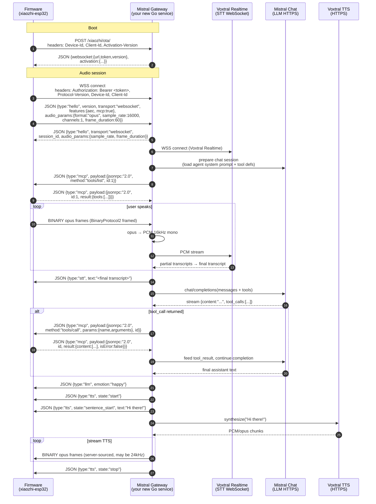

# 07 — Path A: Detailed Implementation Plan

> Build a **xiaozhi-protocol-speaking gateway** that translates to Mistral
> APIs, then redirect the firmware to it via `OTA_URL`. Firmware code
> stays untouched.

This doc gives you everything you need to start building. Wire-protocol
details are sourced from `78/xiaozhi-esp32` (the upstream repo vendored
at `firmware/xiaozhi-esp32/` via `firmware/repos.json`).

## Mistral building blocks (as of 2026)

| Need | Mistral product | Notes |
| --- | --- | --- |
| STT (real-time) | **Voxtral Realtime** | sub-200 ms latency, $0.006/min, streaming WebSocket |
| STT (batch fallback) | **Voxtral Mini Transcribe V2** | speaker diarization, word-level timestamps |
| LLM | **Mistral chat completions** (any chat model) | function-calling for MCP tools |
| TTS | **Voxtral TTS** | 9 languages, zero-shot voice cloning from 3 s of audio |

API base: `https://api.mistral.ai/v1`. Docs:
[Speech to Text](https://docs.mistral.ai/studio-api/audio/speech_to_text),
[Voxtral overview](https://mistral.ai/news/voxtral).

## End-to-end gateway architecture



## Wire protocol cheat sheet (xiaozhi-esp32 v2.2.4)

### OTA discovery

```
POST <CONFIG_OTA_URL>            (default: https://api.tenclass.net/xiaozhi/ota/)
Headers:
  Activation-Version: 1 | 2
  Device-Id:          <MAC address>
  Client-Id:          <UUID>
  Serial-Number:      <optional>
  User-Agent:         <board user-agent>
  Accept-Language:    <lang>
  Content-Type:       application/json

Body: device system info JSON (mac, chip, app version, board, ...)

Response 200:
{
  "websocket": {
    "url":     "wss://your.gateway/xiaozhi/v1/",
    "token":   "<opaque bearer>",
    "version": 2                          // BinaryProtocol version: 1, 2, or 3
  },
  "mqtt": { ... },                        // optional alternative transport
  "activation": {
    "message":    "<text shown to user>",
    "code":       "<6-digit activation code>",
    "challenge":  "<HMAC challenge>",
    "timeout_ms": 60000
  },
  "firmware": { "version": "...", "url": "..." }   // optional OTA
}
```

The `websocket.url` and `token` are persisted to NVS. Your gateway
controls which WS the device dials by what it returns here.

### WebSocket connect headers

```
Authorization:    Bearer <token from OTA response>
Protocol-Version: 1                       // matches BinaryProtocol version
Device-Id:        <MAC>
Client-Id:        <UUID>
```

### Hello handshake

Client → Server (first text frame):

```json
{
  "type": "hello",
  "version": 1,
  "transport": "websocket",
  "features": { "aec": true, "mcp": true },
  "audio_params": {
    "format": "opus",
    "sample_rate": 16000,
    "channels": 1,
    "frame_duration": 60
  }
}
```

Server → Client (must arrive within 10 s or device aborts):

```json
{
  "type": "hello",
  "transport": "websocket",
  "session_id": "<your-uuid>",
  "audio_params": {
    "sample_rate": 16000,
    "frame_duration": 60
  }
}
```

### Binary audio frames

Pick one based on your `OTA.websocket.version`. Recommendation:
**version 2** (timestamps help server-side AEC).

| Version | Layout |
| --- | --- |
| 1 | Raw opus payload, no header |
| **2** | `uint16 version, uint16 type (0=OPUS, 1=JSON), uint32 reserved, uint32 timestamp_ms, uint32 payload_size, payload[]` (all big-endian) |
| 3 | `uint8 type, uint8 reserved, uint16 payload_size, payload[]` |

Audio: **16 kHz mono, 16-bit, 60 ms frames, Opus VBR + DTX, FEC off**.
Server-sent TTS may be at **24 kHz**.

### Server → device JSON message types

| `type` | Fields | Effect |
| --- | --- | --- |
| `tts` | `state: "start" \| "stop" \| "sentence_start"`, `text?` | Drive avatar speaking state + chat bubble |
| `stt` | `text` | (Optional) Echo final transcription back for display |
| `llm` | `emotion` | Drive avatar emotion (`happy`, `neutral`, `sad`, ...) |
| `mcp` | `payload` (JSON-RPC 2.0) | Tool calls / tool list |
| `system` | `command: "reboot"` | Misc commands |
| `alert` | `status, message, emotion` | Modal alert UI |
| `iot` | (deprecated, replaced by `mcp`) | Skip |

### MCP message envelope

Server → device (call a tool the device exposed):

```json
{
  "session_id": "<from hello>",
  "type": "mcp",
  "payload": {
    "jsonrpc": "2.0",
    "method": "tools/call",
    "params": {
      "name": "self.robot.set_head_angles",
      "arguments": { "yaw": 30, "pitch": 0 }
    },
    "id": 42
  }
}
```

Device → server (result):

```json
{
  "session_id": "<...>",
  "type": "mcp",
  "payload": {
    "jsonrpc": "2.0",
    "id": 42,
    "result": {
      "content": [{ "type": "text", "text": "ok" }],
      "isError": false
    }
  }
}
```

To **discover** the tools the device exposes, your gateway sends:

```json
{ "type": "mcp",
  "payload": { "jsonrpc": "2.0", "method": "tools/list", "id": 1 } }
```

Device returns a paginated list of `{ name, description, inputSchema, annotations? }`.

## Mapping MCP ↔ Mistral function calling

Direct mapping. Mistral uses OpenAI-style function specs:

```python
# What the device returns from tools/list:
{
  "name": "self.robot.set_head_angles",
  "description": "Set the head yaw and pitch angles",
  "inputSchema": {
    "type": "object",
    "properties": {
      "yaw":   { "type": "integer" },
      "pitch": { "type": "integer" }
    },
    "required": ["yaw", "pitch"]
  }
}

# What Mistral chat/completions expects in `tools`:
{
  "type": "function",
  "function": {
    "name": "self.robot.set_head_angles",  # keep dotted name as-is
    "description": "...",
    "parameters": <inputSchema verbatim>
  }
}
```

When Mistral returns `tool_calls[].function.arguments` (a JSON string),
parse it and forward as the MCP `tools/call` shown above. When the
device returns the MCP `result`, append a `tool` role message to the
Mistral conversation:

```json
{ "role": "tool",
  "tool_call_id": "<from Mistral>",
  "name": "self.robot.set_head_angles",
  "content": "ok" }
```

Then continue the completion to get the assistant's natural-language
reply.

## Gateway component breakdown

```
server/internal/mistral_gateway/
├── ota.go              Implements POST /xiaozhi/ota/  (returns ws URL)
├── ws.go               Upgrades to WS, runs the per-session loop
├── framing.go          BinaryProtocol2 encode/decode + JSON frame split
├── opus.go             libopus wrapper (encode 24kHz/16kHz, decode 16kHz)
├── stt.go              Voxtral Realtime client
├── tts.go              Voxtral TTS client
├── llm.go              Mistral chat/completions client (streaming)
├── mcp.go              tools/list + tools/call orchestration
├── tools_map.go        MCP inputSchema ↔ Mistral function spec
├── session.go          Per-MAC state machine (idle/listening/thinking/speaking)
└── config.go           Per-agent prompt + voice + model loaded from DB
```

Add to `server/internal/cmd/cmd.go`:

```go
s.Group("/xiaozhi", func(g *ghttp.RouterGroup) {
    g.POST("/ota/", mistral_gateway.OtaHandler)
})
s.BindHandler("/xiaozhi/v1/", mistral_gateway.WsHandler)
```

## Per-session state machine

```
                     ┌────── hello in / out ──────┐
                     ▼                            │
                 [READY] ─── tools/list req ──▶ [READY]
                     │
                     │  first opus frame in
                     ▼
                [LISTENING] ─── opus → Voxtral Realtime PCM stream
                     │  Voxtral final transcript
                     ▼
                [STT_DONE] ─── send {type:"stt", text}
                     │
                     ▼
                [THINKING] ─── Mistral chat/completions (streamed)
                     │
                ┌────┴───── tool_calls? ──── yes ──┐
                no                                 ▼
                │                            [TOOL_CALL] ─ send mcp/tools/call
                │                                 │
                │                                 ▼
                │                          [WAIT_TOOL_RESULT]
                │                                 │  device responds
                │                                 ▼
                │                          back to THINKING (with tool result appended)
                ▼
            [SPEAKING] ─── send {type:"llm", emotion}
                │           send {type:"tts", state:"start"}
                │           per sentence: {type:"tts", state:"sentence_start", text}
                │           Voxtral TTS → opus → BinaryProtocol2 frames
                │           send {type:"tts", state:"stop"}
                ▼
                [READY]
```

## Concrete dependencies to add

```bash
# server/go.mod
go get github.com/hraban/opus              # CGo + libopus (apt: libopus-dev)
go get github.com/gorilla/websocket        # already present
# Mistral has no official Go SDK as of writing — use net/http directly
# or the community client at github.com/mistralai/client-go (verify support)
```

System libs needed on the server host:

```
libopus-dev    (Debian/Ubuntu)
opus           (macOS via brew)
```

## Suggested build order

| Milestone | Goal | Validates |
| --- | --- | --- |
| **M1: OTA stub** | Gateway returns a static OTA JSON; firmware boots, reads it, persists URL | Discovery + headers |
| **M2: Hello echo** | Gateway accepts WS connection, echoes hello, holds it open | Auth + handshake |
| **M3: Audio loopback** | Decode opus → re-encode → send back; you hear yourself in the speaker | BinaryProtocol2 + opus + audio_params |
| **M4: Static TTS** | On any incoming audio, send a fixed Voxtral TTS reply ("hello world") | TTS + sentence_start sequencing |
| **M5: Full STT** | Stream incoming opus to Voxtral Realtime, send `stt` events | Realtime STT |
| **M6: LLM only** | After STT, Mistral chat → TTS reply (no tools yet) | End-to-end voice loop |
| **M7: tools/list** | On hello, request `tools/list`, log them | MCP discovery |
| **M8: tool_calls** | Add tool defs to Mistral; route `tool_calls` back via MCP; feed results | Function-calling round trip |
| **M9: Emotion** | Send `{type:"llm", emotion}` based on Mistral output (extra prompt or classifier) | Avatar reaction |
| **M10: Multi-agent** | Per-MAC agent config (prompt, voice, model) loaded from DB | Production-ready |

Stop at M3 to confirm the wire protocol works before involving any
Mistral APIs. Stop at M6 if you don't need device tools. Tools are
needed if you want the LLM to move the head/play dances/etc.

## Risks and mitigations

| Risk | Mitigation |
| --- | --- |
| Wire-protocol drift on xiaozhi version bumps | Pin the firmware to v2.2.4 (already in `dependencies.lock`); validate before bumping. Or vendor a fork of `xiaozhi-esp32` you control |
| Voxtral Realtime + Mistral chat + Voxtral TTS sequential latency too high | Use streaming on all three; start TTS on first sentence; cap LLM `max_tokens` |
| Opus framing edge cases (DTX silence, partial frames) | Use `BinaryProtocol2` with timestamps; let `audio_service.cc` on the device handle jitter buffering |
| MCP `tools/list` pagination | Implement `cursor` / `nextCursor` handling — devices may return large lists in chunks |
| Server-side AEC | Set `features.aec` in your hello response based on the device claim; rely on the device's AFE for now |
| Authentication | OTA returns the bearer token used to open the WS — generate per-device JWT signed by your gateway |
| Activation flow | The patch in `firmware/patches/xiaozhi-esp32.patch` already simplifies activation to "Please bind in the mobile app." Your OTA can return an empty `activation` block to skip code entry |
| TTS sample rate mismatch (24 kHz from server vs 16 kHz negotiated) | Either re-sample to 16 kHz before opus encoding, or include `sample_rate: 24000` in the server hello `audio_params` (the device honors it) |

## Things you do NOT need to do

- **No firmware code changes** beyond setting `CONFIG_OTA_URL`.
- **No app changes** for the live voice loop.
- **No new audio dependencies** on the device — opus, AFE, wake-word
  all stay.
- **No changes to `/stackChan/ws`** — the companion plane (firmware ↔
  Go ↔ App) is unaffected.

## Out-of-scope (pick later)

- Re-hosting agent config: today the Flutter app writes to `xiaozhi.me`
  via `XiaoZhi_util.dart`. If you want users to configure Mistral
  prompts/voices from the app, also re-target the management plane
  (see `04-app.md` swap table). Otherwise keep using xiaozhi.me as a
  config DB and only the live audio goes through Mistral.
- Multi-tenant isolation, billing per device, conversation logging:
  not modeled in xiaozhi's protocol — add at the gateway layer.
- Migrating chat history viewers in the app to your DB instead of
  `xiaozhi.me`.

## Reference: where to read the protocol source after first clone

After running `python3 firmware/fetch_repos.py` to clone xiaozhi-esp32
locally:

| Concern | File |
| --- | --- |
| WS open + headers + hello | `firmware/xiaozhi-esp32/main/protocols/websocket_protocol.cc` |
| Binary frame versions | `firmware/xiaozhi-esp32/main/protocols/protocol.cc` (search `BinaryProtocol`) |
| OTA request + response parsing | `firmware/xiaozhi-esp32/main/ota.cc` |
| Server message dispatch | `firmware/xiaozhi-esp32/main/application.cc` (`OnIncomingJson`) |
| MCP server | `firmware/xiaozhi-esp32/main/mcp_server.cc` |
| Audio params | `firmware/xiaozhi-esp32/main/audio/audio_service.cc` (`OPUS_FRAME_DURATION_MS`, sample rates) |
