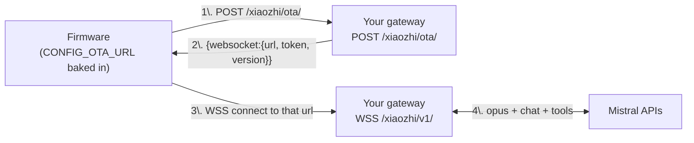

# 08 — Local Dev Setup for the Mistral Gateway

> **STATUS — Up-to-date with shipped Path A (PR #1).** The
> `scripts/dev-gateway.sh` referenced below was added during M1+M2
> and has been kept current with every milestone since (env vars
> printed in the startup banner now reflect M3 through M10).

> The practical "how do I run this on my laptop with one StackChan on
> the desk" layer for [Path A](./06-mistral-migration.md). Wire-protocol
> details and milestones live in [07-path-a-implementation.md](./07-path-a-implementation.md);
> this doc is purely setup + iteration loop.

## Prerequisites

| Tool | Version | Why |
| --- | --- | --- |
| Go | 1.24+ | Existing server (`server/go.mod`) |
| MySQL | 8.0+ | Agent / device DB the server already uses |
| libopus + opusfile | latest | CGo-bound via `github.com/hraban/opus` (used from M3 onwards for opus encode/decode). macOS: `brew install opus opusfile pkg-config`. Debian: `apt install libopus-dev libopusfile-dev pkg-config` |
| Mistral API key | — | `MISTRAL_API_KEY` env var |
| ESP-IDF | v5.5.4 | One-time firmware flash (matches `firmware/dependencies.lock`). Provides `idf.py`. Install: see [`firmware/README.md`](../../firmware/README.md) |
| USB cable | — | Initial flash + serial logs |

## The "flash once, iterate forever" model

Only **one** value is baked into the firmware binary: `CONFIG_OTA_URL`
(`firmware/main/Kconfig.projbuild:5`). Everything else — the WebSocket
URL, the bearer token, audio params, even whether to use WS or MQTT — is
returned dynamically by your OTA endpoint at boot:



Practical consequence:

- **Flash once** with `CONFIG_OTA_URL = <stable URL you control>`.
- After that, change WS URL, prompts, models, tools, opus framing
  version, even swap MQTT for WS — all from the gateway response. **No
  more flashing.**

## Step 1 — Pick a reachable URL for your laptop

The ESP32 needs to reach your laptop. Pick one option and use it as
both `CONFIG_OTA_URL` (baked into firmware) and the `websocket.url`
your gateway returns from OTA.

**Start here: LAN IP.** Zero deps, zero latency, works for the
overwhelming majority of dev setups.

```bash
ipconfig getifaddr en0           # macOS wifi (en1 if ethernet)
# → 192.168.1.42

# Use as:
#   CONFIG_OTA_URL = http://192.168.1.42:12800/xiaozhi/ota/
#   GATEWAY_WS_URL = ws://192.168.1.42:12800/xiaozhi/v1/
```

The Go server already binds `0.0.0.0:12800`, so no server changes
needed. Make sure laptop and StackChan are on the **same wifi /
subnet**.

### Three things that bite when using LAN IP

| Issue | Symptom | Fix |
| --- | --- | --- |
| macOS firewall blocks port 12800 | Device gets connection refused; gateway log silent | System Settings → Network → Firewall → allow incoming on the `go` binary, or `sudo pfctl -d` temporarily |
| Laptop IP changes (DHCP renew, sleep/wake, network switch) | Device stops connecting after a while | Reserve the IP on your router (DHCP static lease) |
| Firmware rejects plain HTTP | Device serial: `tls handshake failed` or `unsupported protocol` | Fall back to a tunnel (next section) |

### When to fall back to a tunnel

Reach for ngrok / cloudflared if any of these apply:

| Scenario | Why a tunnel helps |
| --- | --- |
| Device on guest wifi, laptop on main wifi | Different subnets — direct IP routing fails |
| Demo at a conference / unstable network | Stable URL across networks; no reflashing when wifi changes |
| Firmware refuses plain HTTP | Free trusted TLS cert, no cert-bundle changes on device |
| Sharing the gateway with a teammate | They hit your URL without VPN setup |

```bash
brew install ngrok
ngrok http 12800
# copy https://<random>.ngrok-free.app

# Use as:
#   CONFIG_OTA_URL = https://<random>.ngrok-free.app/xiaozhi/ota/
#   GATEWAY_WS_URL = wss://<random>.ngrok-free.app/xiaozhi/v1/
```

Tradeoff: adds 50–150 ms WAN hop on every request. Fine for hello and
chat, marginal for low-latency audio loops.

### Other options (rarely needed)

| Option | When |
| --- | --- |
| **mDNS** (`http://stackchan-dev.local`) | LAN IP keeps changing; macOS broadcasts by default but ESP-IDF resolver is sometimes flaky |
| **Router DNS rebind** (point `api.tenclass.net` at your laptop) | You can't reflash. Cert handling is the hard part — see appendix |

## Step 2 — One-time firmware flash

Edit the Kconfig default:

```diff
 # firmware/main/Kconfig.projbuild:5
 config OTA_URL
     string "Default OTA URL"
-    default "https://api.tenclass.net/xiaozhi/ota/"
+    default "http://192.168.1.42:12800/xiaozhi/ota/"
     help
         The application will access this URL to check for new firmwares and server address.
```

Then build and flash (requires ESP-IDF v5.5.4 sourced — see
[`firmware/README.md`](../../firmware/README.md)):

```bash
cd firmware
python3 ./fetch_repos.py        # if not already cloned
source ~/esp/esp-idf/export.sh  # puts idf.py in PATH
idf.py set-target esp32s3       # first time only
idf.py menuconfig               # confirm "Default OTA URL" under "Xiaozhi Assistant"
idf.py build flash monitor
```

`monitor` keeps the serial log open — useful for the verify step
below.

> Prefer not to edit the tracked Kconfig? Override via
> `sdkconfig.defaults` or pass `-DCONFIG_OTA_URL=...` to `idf.py`.

## Step 3 — Run the gateway

The gateway is a new package inside the existing Go server, so no extra
process. Easiest path — let the helper script auto-detect your LAN IP,
print the flash instructions, and start the server:

```bash
cd server
./scripts/dev-gateway.sh
```

It prints the exact OTA URL to paste into `idf.py menuconfig`, the
expected log lines, and common firewall/IP gotchas — then `exec`s
`go run main.go`. Override with `IP=<addr>` or `PORT=<n>` env vars if
auto-detection picks the wrong interface.

Manual equivalent (minimal):

```bash
cd server
export MISTRAL_API_KEY=sk-...
export GATEWAY_WS_URL=ws://192.168.1.42:12800/xiaozhi/v1/   # what OTA returns
go run main.go
```

The script reads `~/.stackchan-dev/server-config.yaml` for RSA keys
and JWT secret (auto-generated on first run, GoFrame's `utility/rsa.go`
panics on empty keys).

### All env vars (M1 → M10 cheat sheet)

The script's startup banner already prints these in groups; this is
the flat reference. Defaults all "just work" — set only what you need
to override.

| Variable | Default | What |
| --- | --- | --- |
| `GATEWAY_WS_URL` | `ws://localhost:12800/xiaozhi/v1/` | Returned in OTA response; must be reachable from the device |
| `GATEWAY_OPUS_VERSION` | `2` | BinaryProtocol2 version advertised in OTA |
| `MISTRAL_API_KEY` | (empty) | Required from M4 onwards. Without it, gateway falls back to M3 echo loopback (offline-friendly fallback) |
| `MISTRAL_TTS_MODEL` | `voxtral-mini-tts-2603` | TTS model |
| `MISTRAL_TTS_VOICE` | (auto) | Voice ID; auto-discovers a preset voice if unset |
| `GATEWAY_TTS_REPLY` | "Hello! …" | Static greeting (used only if STT path is disabled) |
| `GATEWAY_TTS_PEAK` | `28000` | Peak normalize target (signed int16 magnitude). 0 disables boost |
| `GATEWAY_TTS_STREAM` | `true` | M6: SSE streaming TTS (vs buffered WAV) |
| `MISTRAL_TTS_PCM_RATE` | `24000` | Sample rate Voxtral emits in `pcm` streaming mode |
| `MISTRAL_STT_MODEL` | `voxtral-mini-latest` | STT model |
| `MISTRAL_STT_LANGUAGE` | (auto) | ISO language hint (e.g. `en`, `fr`); empty lets the model auto-detect |
| `GATEWAY_STT_REPLY` | `"You said: %s"` | M5 echo template; used as fallback when chat is off or fails. Set to "" to fall back to static greeting |
| `GATEWAY_CHAT_ENABLED` | `true` | M7: route transcripts through Mistral chat completions |
| `MISTRAL_CHAT_MODEL` | `mistral-small-latest` | Chat model |
| `GATEWAY_CHAT_SYSTEM` | (StackChan persona) | System prompt — see config.go for the full default |
| `GATEWAY_CHAT_MAX_TOKENS` | `200` | Max reply tokens (~15-25 spoken seconds) |
| `GATEWAY_CHAT_HISTORY` | `6` | Last N messages (= last 3 exchanges) replayed each turn. 0 disables memory |
| `GATEWAY_CHAT_TOOLS` | `true` | M8b: forward MCP tools to chat completions |
| `GATEWAY_CHAT_TOOL_MAX_ITER` | `3` | Cap on chat→tool→chat round-trips per user turn |
| `GATEWAY_CHAT_TOOL_BLOCK` | (auto) | Comma-separated tool names hidden from Mistral. Auto-blocks `take_photo` when vision is off; "-" disables blocking entirely |
| `GATEWAY_VISION_ENABLED` | `true` | M9: enable photo upload + Pixtral analysis endpoint |
| `MISTRAL_VISION_MODEL` | `mistral-medium-latest` | Vision model |
| `GATEWAY_VISION_URL` | (auto) | Auto-derived from `GATEWAY_WS_URL`; override only behind a reverse proxy |
| `GATEWAY_PHOTO_DIR` | `./photos` | Where saved JPEGs land. Empty disables saving |
| `GATEWAY_VISION_MAX_BYTES` | `1048576` | Max upload size (1 MB) |
| `GATEWAY_VISION_PROMPT` | (audio-friendly wrapper) | `%s` is replaced with the user's question |
| `GATEWAY_EMOTION_ENABLED` | `true` | M10: parse `[emotion:NAME]` tags from LLM reply, send to device avatar |

Expected log lines on first device boot (M1–M2):

```
INFO  /xiaozhi/ota/  device_id=AA:BB:CC:DD:EE:FF client_id=...
INFO  ota response  ws_url=ws://192.168.1.42:12800/xiaozhi/v1/  token=eyJ...
INFO  /xiaozhi/v1/  upgrade  device_id=AA:BB:CC:DD:EE:FF
INFO  hello  format=opus rate=16000 frame=60ms features={aec:true mcp:true}
INFO  hello-ack sent  session_id=...
INFO  mcp initialize ok  vision_url=http://192.168.1.42:12800/xiaozhi/vision/explain
INFO  mcp tools/list ok  count=11  exposed=11  tools=[self.robot.set_head_angles ...]
```

Routes bound in `server/internal/cmd/cmd.go`:

```go
s.BindHandler("POST:/xiaozhi/ota/", mistral_gateway.OtaHandler)
s.BindHandler("/xiaozhi/v1/", mistral_gateway.WsHandler)
s.BindHandler("POST:/xiaozhi/vision/explain", mistral_gateway.VisionExplainHandler)
```

(See [07-path-a-implementation.md](./07-path-a-implementation.md#gateway-component-breakdown)
for the full package layout.)

### Smoke-test the OTA endpoint without a device

Before flashing, sanity-check the OTA response shape with curl:

```bash
curl -s -X POST http://localhost:12800/xiaozhi/ota/ \
  -H 'Device-Id: AA:BB:CC:DD:EE:FF' \
  -H 'Client-Id: dev-curl' \
  -H 'Content-Type: application/json' \
  -d '{}' | jq
```

Expected:

```json
{
  "websocket": {
    "url":     "ws://localhost:12800/xiaozhi/v1/",
    "token":   "dev-<uuid>",
    "version": 2
  }
}
```

### Smoke-test the WS hello with `websocat`

```bash
brew install websocat   # if needed
echo '{"type":"hello","version":1,"transport":"websocket","features":{"mcp":true},"audio_params":{"format":"opus","sample_rate":16000,"channels":1,"frame_duration":60}}' \
  | websocat ws://localhost:12800/xiaozhi/v1/
```

Expected reply within 10 s:

```json
{"type":"hello","transport":"websocket","session_id":"...","audio_params":{"sample_rate":16000,"frame_duration":60}}
```

## Step 4 — Verify

Walk the milestones from `07` end-to-end. First three need no Mistral
calls and isolate the wire protocol:

| Milestone | What you check | Expected |
| --- | --- | --- |
| M1 OTA stub | Device boots, hits `/xiaozhi/ota/`, persists URL | Serial log `OTA url saved` |
| M2 Hello echo | WS connects, `hello` exchanged within 10 s | Gateway logs `hello-ack sent` |
| M3 Audio loopback | Speak a phrase → hear yourself in the speaker | Round-trip opus works |

Stop at M3 to confirm the wire protocol before involving Mistral. Then
M4–M6 wire in TTS, STT, and the full LLM loop.

## Iteration loop

What you can change without reflashing:

| Change | Where | Reflash? |
| --- | --- | --- |
| Gateway logic (any `.go` file) | `server/internal/mistral_gateway/` | No — `go run` again |
| WS URL the device connects to | OTA response `websocket.url` | No — device re-reads on next boot |
| Bearer token / auth scheme | OTA response `websocket.token` | No |
| Opus framing version | OTA response `websocket.version` | No |
| Audio sample rate (server TTS) | Server hello `audio_params.sample_rate` | No |
| LLM model, system prompt, tools | Gateway code / DB | No |
| Voxtral voice, language | Gateway code / DB | No |
| MCP tools the **device** exposes | Firmware (`hal_mcp.cpp`) | **Yes** |
| `CONFIG_OTA_URL` itself | Kconfig | **Yes** |
| Anything in the firmware proper | `firmware/main/` | **Yes** |

Rule of thumb: if it's in the OTA response or the WS protocol, it's
runtime. If it's in the firmware binary, it's a flash.

## Troubleshooting

| Symptom | Likely cause | Fix |
| --- | --- | --- |
| Serial log: `connect to OTA failed` | Device can't reach laptop (different subnet, firewall, IP changed) | Confirm laptop IP; allow port through firewall (`sudo pfctl` on macOS); switch to a tunnel |
| Serial log: `tls handshake failed` | Self-signed cert or HTTP rejected | Use ngrok/cloudflared (free trusted cert) or add CA to firmware cert bundle |
| Serial log: `ws hello timeout` | Gateway didn't reply within 10 s | Profile `OtaHandler` / `WsHandler`; pre-warm Mistral connections; remove blocking calls from hello path |
| Device keeps connecting to old URL | NVS still holds previous OTA result | `idf.py erase_flash` then re-flash; or have the gateway return a `firmware.version` bump to force re-discovery |
| `unknown opus packet` server-side | Framing version mismatch | Match `websocket.version` in OTA response to what gateway decodes (default to 2 — see protocol cheat sheet in `07`) |
| Audio choppy or wrong pitch | Sample rate mismatch | Confirm 16 kHz mono on device side; if TTS is 24 kHz, declare `sample_rate: 24000` in server hello |
| Device can't find `*.local` | mDNS resolver flaky on ESP-IDF | Switch to LAN IP or a tunnel |

## Appendix — Skip the flash via DNS rebind

If you cannot reflash (locked-down device, no USB access), you can hijack
the upstream OTA URL at the network layer:

1. In your router, add a DNS rule: `api.tenclass.net → <your laptop IP>`.
2. Run the gateway on port 443 with a cert valid for `api.tenclass.net`
   (you'll need to trust your own CA on the device, or use a SAN cert
   from a trusted source — non-trivial).
3. The device boots, resolves `api.tenclass.net` to your laptop, hits
   your gateway thinking it's xiaozhi.me.

Caveats:

- Breaks for any other device on the network that legitimately uses
  xiaozhi.me.
- Cert handling is the hard part — without a trusted cert the device's
  TLS handshake fails.
- Non-portable: stops working the moment the device leaves your LAN.

Use only as a last resort. The one-time flash in Step 2 is almost
always the right path.
